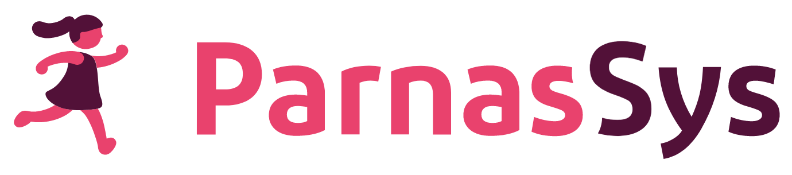

# HelloID-Conn-Prov-Source-Topicus-ParnasSys

> **Not implemented yet**

  

## Introduction
This connector retrieves the data from ParnasSys. The persons and contracts. The connectors contains two "person" scripts. One for the Employee and one for the Student. There is no Department script.

## Prerequisites
 - The connector depends on the additional Custom fields. Make sure these a present before importing the mapping
    -  CustomField Persons:
        - Custom.Brin
        - Custom.id
        - Custom.leerlingNummer
        - Custom.PersonType
        - Custom.datumAanmelding
    -  CustomField Contracts:
        - Custom.ContractType
        - Custom.leerjaar

## Connection settings
The following settings are required to connect to the API.

| Setting     | Description |
| ------------ | ----------- |
| webServiceUri     |URL to the webservice. Example: https://parnassys.net or https://acceptatie.parnassys.net/bao/services/cxf/v3/generic  |
| supplierName   |The supplier name (account) used for the connection example: *Identity & Access Manager (IAM)*  |
| supplierKey    |  The associated password|
| brinIdentifiers | An array of brin numbers representing the schools/organizations from wich to collect data.  The script loops though all schools in this list
| schoolYear | The year to get from the webservice. Example: *2020 / 2021*
| Proxy | To sent your request via a Proxy

## Specific remarks regarding this Connector and script
- Currently it exist of 2 Persons.ps1 scripts
- The department script in HelloID is not used and can be left empty.
- It collects information about both "Leerlingen" and "medewerkers".
- The "PersonType" field is added to denote the type.

# HelloID Docs
The official HelloID documentation can be found at: https://docs.helloid.com/
